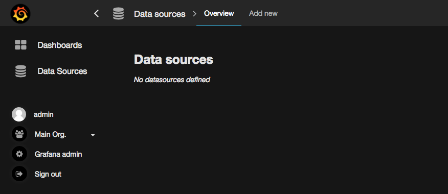
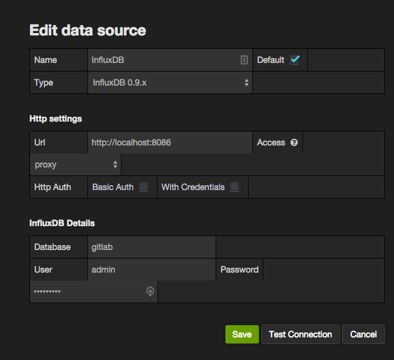

# Grafana Configuration

[Grafana](http://grafana.org/) is a tool that allows you to visualize time
series metrics through graphs and dashboards. It supports several backend
data stores, including InfluxDB. GitLab writes performance data to InfluxDB
and Grafana will allow you to query InfluxDB to display useful graphs.

For the easiest installation and configuration, install Grafana on the same
server as InfluxDB. For larger installations, you may want to split out these
services.

## Installation

Grafana supplies package repositories (Yum/Apt) for easy installation.
See [Grafana installation documentation](http://docs.grafana.org/installation/)
for detailed steps.

> **Note**: Before starting Grafana for the first time, set the admin user
and password in `/etc/grafana/grafana.ini`. Otherwise, the default password
will be `admin`.

## Configuration

Login as the admin user. Expand the menu by clicking the Grafana logo in the
top left corner. Choose 'Data Sources' from the menu. Then, click 'Add new'
in the top bar.



Fill in the configuration details for the InfluxDB data source. Save and
Test Connection to ensure the configuration is correct.

- **Name**: InfluxDB
- **Default**: Checked
- **Type**: InfluxDB 0.9.x (Even if you're using InfluxDB 0.10.x)
- **Url**: https://localhost:8086 (Or the remote URL if you've installed InfluxDB
on a separate server)
- **Access**: proxy
- **Database**: gitlab
- **User**: admin (Or the username configured when setting up InfluxDB)
- **Password**: The password configured when you set up InfluxDB



## Apply retention policies and create continuous queries

If you intend to import the GitLab provided Grafana dashboards, you will need
to copy and run a set of queries against InfluxDB to create the needed data
sets.

On the InfluxDB server, run the following command, substituting your InfluxDB
user and password:

```bash
influxdb --username admin -password super_secret
```

This will drop you in to an InfluxDB interactive session. Copy the entire
contents below and paste it in to the interactive session:

```
CREATE RETENTION POLICY gitlab_30d ON gitlab DURATION 30d REPLICATION 1 DEFAULT
CREATE RETENTION POLICY seven_days ON gitlab DURATION 7d REPLICATION 1
CREATE CONTINUOUS QUERY rails_transaction_timings_seven_days ON gitlab BEGIN SELECT percentile("duration", 95.000) AS "duration_95th", percentile("duration", 99.000) AS "duration_99th", mean("duration") AS "duration_mean", percentile(sql_duration, 95.000) AS "sql_duration_95th", percentile(sql_duration, 99.000) AS "sql_duration_99th", mean(sql_duration) AS "sql_duration_mean", percentile(view_duration, 95.000) AS "view_duration_95th", percentile(view_duration, 99.000) AS "view_duration_99th", mean(view_duration) AS "view_duration_mean" INTO gitlab.seven_days.rails_transaction_timings FROM gitlab.gitlab_30d.rails_transactions GROUP BY time(1m) END
CREATE CONTINUOUS QUERY sidekiq_transaction_timings_seven_days ON gitlab BEGIN SELECT percentile("duration", 95.000) AS "duration_95th", percentile("duration", 99.000) AS "duration_99th", mean("duration") AS "duration_mean", percentile(sql_duration, 95.000) AS "sql_duration_95th", percentile(sql_duration, 99.000) AS "sql_duration_99th", mean(sql_duration) AS "sql_duration_mean", percentile(view_duration, 95.000) AS "view_duration_95th", percentile(view_duration, 99.000) AS "view_duration_99th", mean(view_duration) AS "view_duration_mean" INTO gitlab.seven_days.sidekiq_transaction_timings FROM gitlab.gitlab_30d.sidekiq_transactions GROUP BY time(1m) END
CREATE CONTINUOUS QUERY rails_transaction_counts_seven_days ON gitlab BEGIN SELECT count("duration") AS "count" INTO gitlab.seven_days.rails_transaction_counts FROM gitlab.gitlab_30d.rails_transactions GROUP BY time(1m) END
CREATE CONTINUOUS QUERY sidekiq_transaction_counts_seven_days ON gitlab BEGIN SELECT count("duration") AS "count" INTO gitlab.seven_days.sidekiq_transaction_counts FROM gitlab.gitlab_30d.sidekiq_transactions GROUP BY time(1m) END
CREATE CONTINUOUS QUERY rails_method_call_timings_seven_days ON gitlab BEGIN SELECT percentile("duration", 95.000) AS "duration_95th", percentile("duration", 99.000) AS "duration_99th", mean("duration") AS "duration_mean" INTO gitlab.seven_days.rails_method_call_timings FROM gitlab.gitlab_30d.rails_method_calls GROUP BY time(1m) END
CREATE CONTINUOUS QUERY sidekiq_method_call_timings_seven_days ON gitlab BEGIN SELECT percentile("duration", 95.000) AS "duration_95th", percentile("duration", 99.000) AS "duration_99th", mean("duration") AS "duration_mean" INTO gitlab.seven_days.sidekiq_method_call_timings FROM gitlab.gitlab_30d.sidekiq_method_calls GROUP BY time(1m) END
CREATE CONTINUOUS QUERY rails_method_call_timings_per_method_seven_days ON gitlab BEGIN SELECT percentile("duration", 95.000) AS duration_95th, percentile("duration", 99.000) AS duration_99th, mean("duration") AS duration_mean INTO gitlab.seven_days.rails_method_call_timings_per_method FROM gitlab.gitlab_30d.rails_method_calls GROUP BY time(1m), method END
CREATE CONTINUOUS QUERY sidekiq_method_call_timings_per_method_seven_days ON gitlab BEGIN SELECT percentile("duration", 95.000) AS duration_95th, percentile("duration", 99.000) AS duration_99th, mean("duration") AS duration_mean INTO gitlab.seven_days.sidekiq_method_call_timings_per_method FROM gitlab.gitlab_30d.sidekiq_method_calls GROUP BY time(1m), method END
CREATE CONTINUOUS QUERY rails_memory_usage_per_minute ON gitlab BEGIN SELECT percentile(value, 95.000) AS memory_95th, percentile(value, 99.000) AS memory_99th, mean(value) AS memory_mean INTO gitlab.seven_days.rails_memory_usage_per_minute FROM gitlab.gitlab_30d.rails_memory_usage GROUP BY time(1m) END
CREATE CONTINUOUS QUERY sidekiq_memory_usage_per_minute ON gitlab BEGIN SELECT percentile(value, 95.000) AS memory_95th, percentile(value, 99.000) AS memory_99th, mean(value) AS memory_mean INTO gitlab.seven_days.sidekiq_memory_usage_per_minute FROM gitlab.gitlab_30d.sidekiq_memory_usage GROUP BY time(1m) END
CREATE CONTINUOUS QUERY sidekiq_file_descriptors_per_minute ON gitlab BEGIN SELECT sum(value) AS value INTO gitlab.seven_days.sidekiq_file_descriptors_per_minute FROM gitlab.gitlab_30d.sidekiq_file_descriptors GROUP BY time(1m) END
CREATE CONTINUOUS QUERY rails_file_descriptors_per_minute ON gitlab BEGIN SELECT sum(value) AS value INTO gitlab.seven_days.rails_file_descriptors_per_minute FROM gitlab.gitlab_30d.rails_file_descriptors GROUP BY time(1m) END
CREATE CONTINUOUS QUERY rails_gc_counts_per_minute ON gitlab BEGIN SELECT sum(count) AS count INTO gitlab.seven_days.rails_gc_counts_per_minute FROM gitlab.gitlab_30d.rails_gc_statistics GROUP BY time(1m) END
CREATE CONTINUOUS QUERY sidekiq_gc_counts_per_minute ON gitlab BEGIN SELECT sum(count) AS count INTO gitlab.seven_days.sidekiq_gc_counts_per_minute FROM gitlab.gitlab_30d.sidekiq_gc_statistics GROUP BY time(1m) END
CREATE CONTINUOUS QUERY rails_gc_timings_per_minute ON gitlab BEGIN SELECT percentile(total_time, 95.000) AS duration_95th, percentile(total_time, 99.000) AS duration_99th, mean(total_time) AS duration_mean INTO gitlab.seven_days.rails_gc_timings_per_minute FROM gitlab.gitlab_30d.rails_gc_statistics GROUP BY time(1m) END
CREATE CONTINUOUS QUERY sidekiq_gc_timings_per_minute ON gitlab BEGIN SELECT percentile(total_time, 95.000) AS duration_95th, percentile(total_time, 99.000) AS duration_99th, mean(total_time) AS duration_mean INTO gitlab.seven_days.sidekiq_gc_timings_per_minute FROM gitlab.gitlab_30d.sidekiq_gc_statistics GROUP BY time(1m) END
CREATE CONTINUOUS QUERY rails_gc_major_minor_per_minute ON gitlab BEGIN SELECT sum(major_gc_count) AS major, sum(minor_gc_count) AS minor INTO gitlab.seven_days.rails_gc_major_minor_per_minute FROM gitlab.gitlab_30d.rails_gc_statistics GROUP BY time(1m) END
CREATE CONTINUOUS QUERY sidekiq_gc_major_minor_per_minute ON gitlab BEGIN SELECT sum(major_gc_count) AS major, sum(minor_gc_count) AS minor INTO gitlab.seven_days.sidekiq_gc_major_minor_per_minute FROM gitlab.gitlab_30d.sidekiq_gc_statistics GROUP BY time(1m) END
```

## Import Dashboards

You can now import a set of default dashboards that will give you a good
start on displaying useful information. GitLab has published a set of default
[Grafana dashboards][grafana-dashboards] to get you started. Clone the
repository or download a zip/tarball, then follow these steps to import each
JSON file.

Open the dashboard dropdown menu and click 'Import'


Click 'Choose file' and browse to the location where you downloaded or cloned
the dashboard repository. Pick one of the JSON files to import.


Once the dashboard is imported, be sure to click save icon in the top bar. If
you do not save the dashboard after importing it will be removed when you
navigate away.


Repeat this process for each dashboard you wish to import.

[grafana-dashboards]: https://gitlab.com/gitlab-org/grafana-dashboards

---

Read more on:

- [Introduction to GitLab Performance Monitoring](introduction.md)
- [GitLab Configuration](gitlab_configuration.md)
- [InfluxDB Installation/Configuration](influxdb_configuration.md)
- [InfluxDB Schema](influxdb_schema.md)
